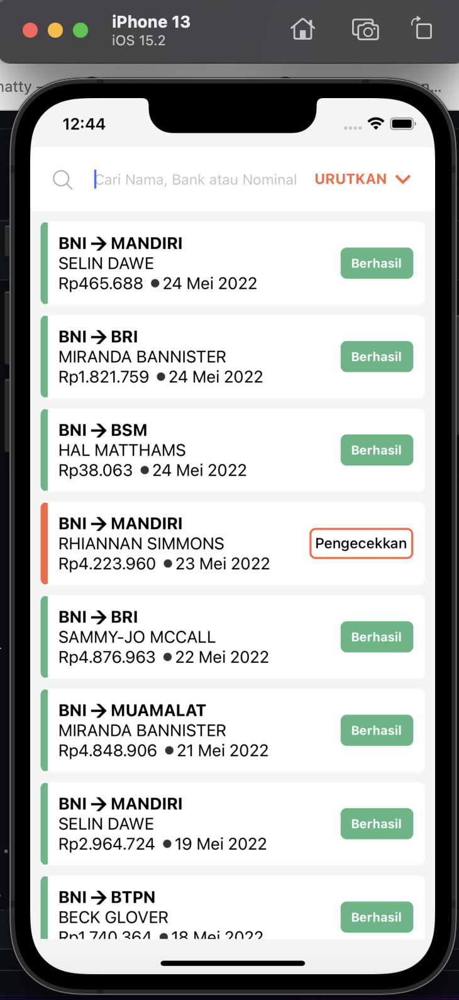

# TransactionApp
> Transaction app for joining big startup company.

## Table of Contents
* [Setup](#setup)
* [Usage](#usage)
* [Project Status](#project-status)
* [Room for Improvement](#room-for-improvement)

## Preview

## General Information
- A Transaction App has 2 screens
- Index screen for view all transaction data with status for every transaction
- Detail Page : it has all informations about the selected transaction
- it can be searched or filtered by name, sender bank, beneficiary bank, transaction's amount
- it can be sorted by name A-Z, name Z-A,date newest,date oldest

## Technologies Used
- React - Native 0.68.2
- Redux Toolkit (state management)
- React Navigation

## Features
List the ready features here:
- Search Feature
- Sort Feature

## Setup
Run npm install on react-native project
cd ios && pod install
note : use react-native link (if Needed)

## Usage
npx react-native run-android 
npx react-native run-ios
